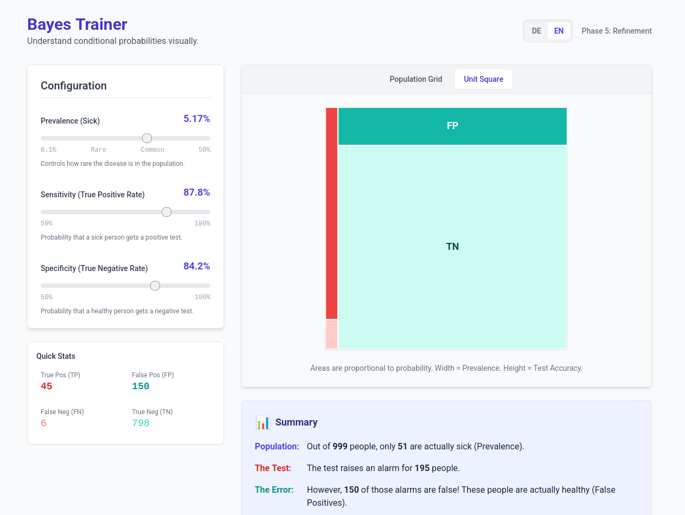

# Bayes Trainer

Interactive trainer for understanding and applying **Bayes' Theorem** in the context of Statistik 1.



## Features

- **Step-by-Step Guidance**: Learn how to calculate posterior probabilities from prior probabilities and likelihoods.
- **Interactive Scenarios**: Practice with various statistical problems commonly found in introductory statistics courses.
- **Immediate Feedback**: Get instant verification of your calculations to improve learning.
- **Multilingual Support**: Available in German and English.

## Concepts Covered

- Conditional Probabilities $P(A|B)$
- Prior Probabilities $P(A)$
- Likelihoods $P(B|A)$
- Posterior Probabilities $P(A|B)$
- Law of Total Probability

## Getting Started

### Prerequisites

- [Node.js](https://nodejs.org/) (Version 18 or higher recommended)
- `pnpm` (or `npm`/`yarn`)

### Installation

1. Navigate to the app directory:
   ```bash
   cd apps/bayes-trainer
   ```
2. Install dependencies:
   ```bash
   pnpm install
   ```
3. Run the development server:
   ```bash
   pnpm dev
   ```

## Tech Stack

- **React**: UI Framework
- **TypeScript**: Type-safe development
- **Vite**: Modern build tool
- **Tailwind CSS**: Styling
- **Vitest**: Unit testing
