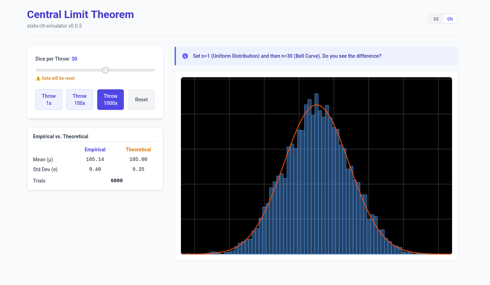

# CLT Simulator (Central Limit Theorem)

A visual simulation tool to demonstrate the **Central Limit Theorem**, a fundamental concept in Statistik 1.



## Features

- **Distribution Selection**: Choose from various population distributions (Uniform, Normal, Exponential, etc.).
- **Interactive Sampling**: Adjust sample sizes ($n$) and number of samples to see how the sampling distribution of the mean evolves.
- **Real-time Visualization**: Watch the distribution of sample means converge to a normal distribution as $n$ increases.
- **Statistical Parameters**: Compare population parameters with sample statistics.

## Concepts Covered

- Population Distribution vs. Sampling Distribution
- Mean ($\mu$) and Variance ($\sigma^2$)
- Sample size effect on the standard error of the mean
- Convergence to Normality (regardless of the original distribution shape)

## Getting Started

### Prerequisites

- [Node.js](https://nodejs.org/) (Version 18 or higher recommended)
- `pnpm` (or `npm`/`yarn`)

### Installation

1. Navigate to the app directory:
   ```bash
   cd apps/stats-clt-simulator
   ```
2. Install dependencies:
   ```bash
   pnpm install
   ```
3. Run the development server:
   ```bash
   pnpm dev
   ```

## Tech Stack

- **React**: UI Framework
- **TypeScript**: Type-safe development
- **Vite**: Modern build tool
- **Tailwind CSS**: Styling
- **Recharts** (or similar): Data visualization for histograms and charts
