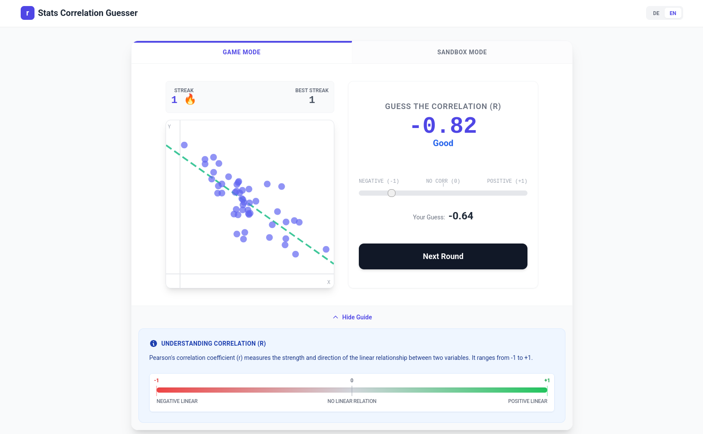

# Stat Correlation Guesser

A gamified approach to developing an intuition for **Pearson Correlation Coefficients** ($r$), a key descriptive statistic.



## Features

- **Interactive Learning**: Guess the correlation coefficient of randomly generated scatter plots.
- **Immediate Data Feedback**: See the true $r$ value and the regression line after each guess.
- **Score Tracking**: Test your skills and see how your intuition improves over time.
- **Dynamic Scatter Plots**: Wide range of patterns from perfectly linear to completely random.

## Concepts Covered

- Pearson Correlation Coefficient ($r$)
- Scatter Plots and Data Visualization
- Positive vs. Negative Correlation
- Strength of Linear Relationships
- Outliers and their effect on $r$

## Getting Started

### Prerequisites

- [Node.js](https://nodejs.org/) (Version 18 or higher recommended)
- `pnpm` (or `npm`/`yarn`)

### Installation

1. Navigate to the app directory:
   ```bash
   cd apps/stats-correlation-guesser
   ```
2. Install dependencies:
   ```bash
   pnpm install
   ```
3. Run the development server:
   ```bash
   pnpm dev
   ```

## Tech Stack

- **React**: UI Framework
- **TypeScript**: Type-safe development
- **Vite**: Modern build tool
- **Tailwind CSS**: Styling
- **Canvas API / Chart.js**: High-performance scatter plot rendering
