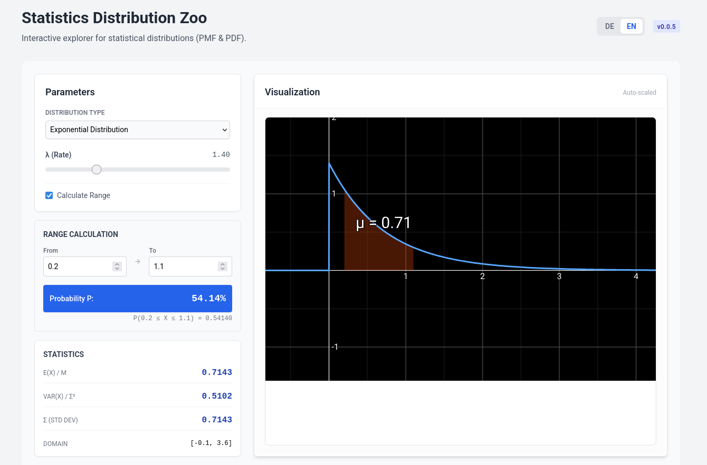

# Stats Distribution Zoo

An interactive explorer for various **Probability Distributions**, helping students visualize parameters and their effects on probability density/mass functions (PDF/PMF).



## Features

- **Wide Variety of Distributions**: Explore Normal, Binomial, Poisson, Exponential, t-Distribution, and many more.
- **Dynamic Parameter Control**: Use sliders to adjust parameters like $\mu$, $\sigma$, $n$, $p$, or $\lambda$ and watch the distribution change in real-time.
- **Interactive Probing**: Hover over the chart to see exact probability values at specific points.
- **Side-by-Side Comparisons**: (If implemented) Compare different distributions or the same distribution with different parameters.
- **Multilingual Support**: Toggle between German (DE) and English (EN).

## Concepts Covered

- Discrete vs. Continuous Distributions
- PDF (Probability Density Function) and PMF (Probability Mass Function)
- CDF (Cumulative Distribution Function)
- Parameters and their effects on center, spread, and shape
- Interrelation between distributions (e.g., Normal approximation of Binomial)

## Getting Started

### Prerequisites

- [Node.js](https://nodejs.org/) (Version 18 or higher recommended)
- `pnpm` (or `npm`/`yarn`)

### Installation

1. Navigate to the app directory:
   ```bash
   cd apps/stats-distribution-zoo
   ```
2. Install dependencies:
   ```bash
   pnpm install
   ```
3. Run the development server:
   ```bash
   pnpm dev
   ```

## Tech Stack

- **React**: UI Framework
- **TypeScript**: Type-safe development
- **Vite**: Modern build tool
- **Tailwind CSS**: Styling
- **Recharts**: Data visualization for distribution plots
