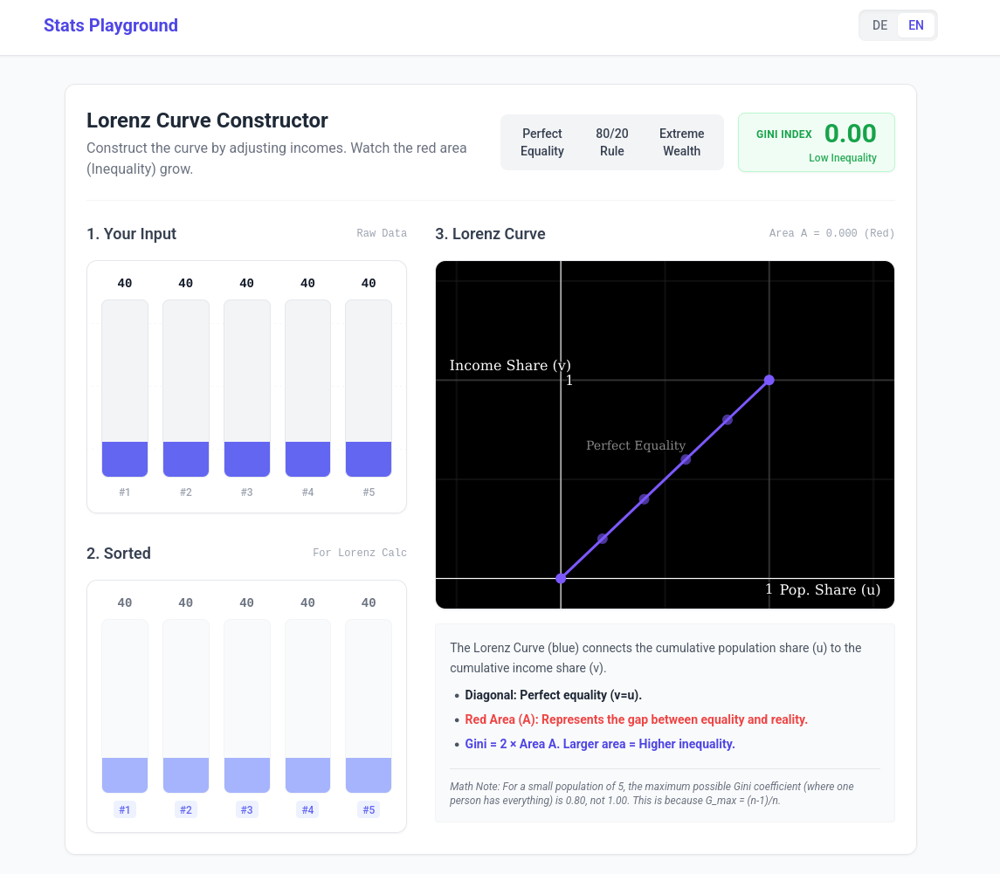

# Lorenz Constructor

An interactive tool for constructing and analyzing **Lorenz Curves**, a key measure of inequality in Statistik 1.



## Features

- **Data Input**: Add and adjust data points to see how they impact the distribution of wealth or resources.
- **Dynamic Visualization**: Real-time rendering of the Lorenz curve based on the current data.
- **Automated Calculations**: Instantly see the calculated **Gini Coefficient** and other inequality metrics.
- **Interactive Points**: Drag and drop or edit values directly to see immediate visual feedback.
- **Multilingual Support**: Available in German (DE) and English (EN).

## Concepts Covered

- Lorenz Curve
- Cumulative Share of Population vs. Cumulative Share of Value
- Line of Perfect Equality
- Gini Coefficient (Area calculation)
- Concentration and Inequality measures

## Getting Started

### Prerequisites

- [Node.js](https://nodejs.org/) (Version 18 or higher recommended)
- `pnpm` (or `npm`/`yarn`)

### Installation

1. Navigate to the app directory:
   ```bash
   cd apps/stats-lorenz-constructor
   ```
2. Install dependencies:
   ```bash
   pnpm install
   ```
3. Run the development server:
   ```bash
   pnpm dev
   ```

## Tech Stack

- **React**: UI Framework
- **TypeScript**: Type-safe development
- **Vite**: Modern build tool
- **Tailwind CSS**: Styling
- **Recharts / SVG**: Custom rendering for the Lorenz curve plot
